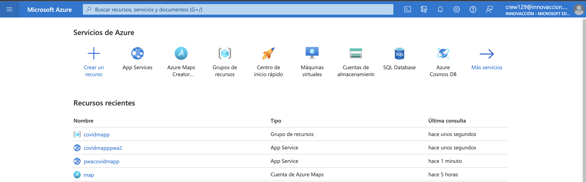
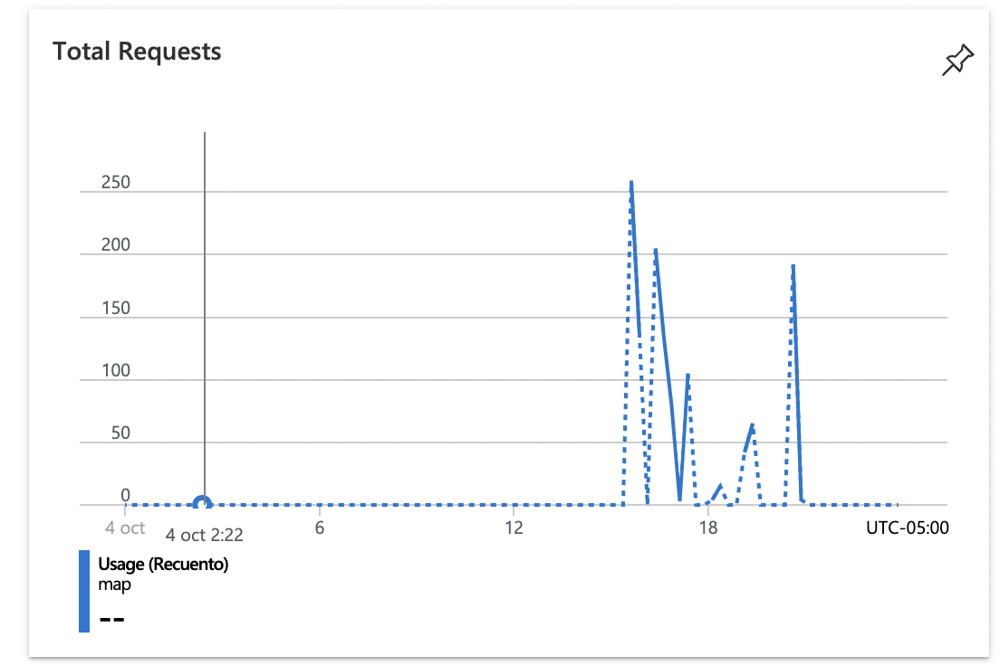
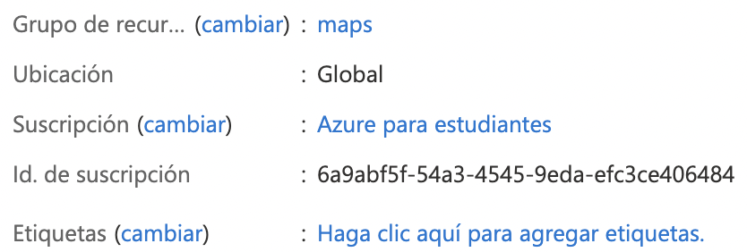
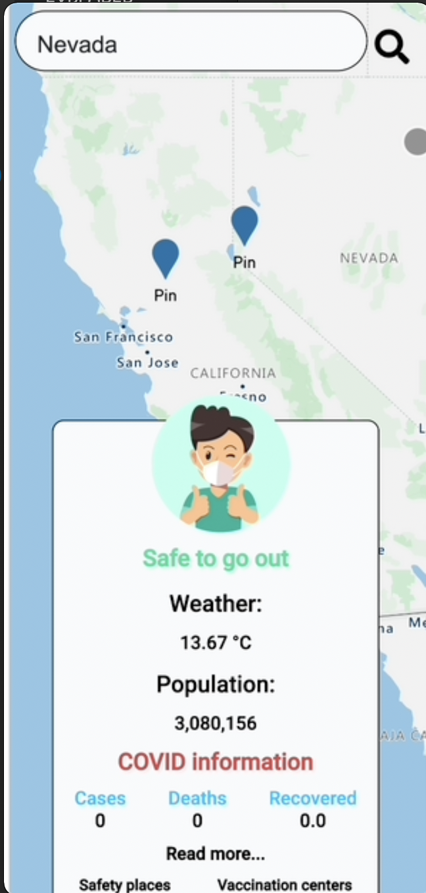
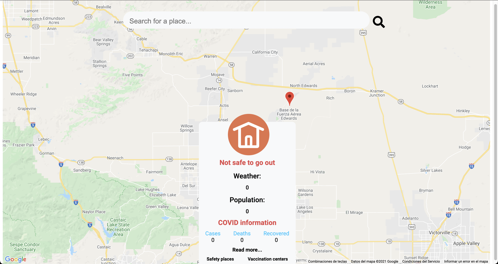
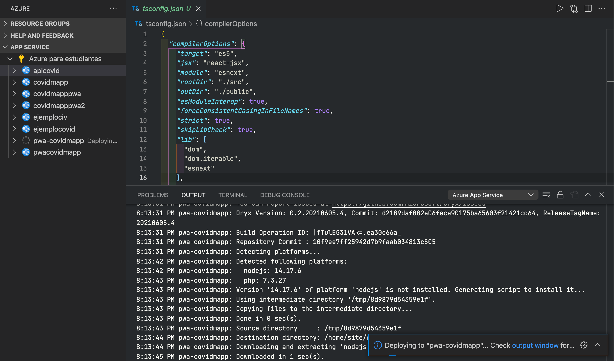
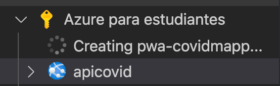

# CovidMapp by gema expansion.

   
   

### La aplicación **"CovidMapp"** es capaz de proporcionar información segura al usuario sobre los riesgos y condiciones de salir al exterior, previniendo posibles riesgos de contagio e informando sobre las mejores medidas sanitarias a tomar. Las personas tendrán la oportunidad de verificar los riesgos de salir a la calle y así tomar ciertas medidas para salvaguardar su salud.

> Desarrollado para el NASA Space Challengue.
> Presentado para Innovaccion Virtual

Esta aplicación muestra al usuario algunas condiciones sobre COVID-19 de un destino, la aplicación toma la información de un lugar y procesa si es seguro o no salir para que el usuario pueda tomar una decisión sobre los datos representados. Esta PWA (Aplicación Web Progresiva) brinda información sobre lugares, también información sobre algunas variables, como la población y el clima. También incluye enlaces para mantener la información disponible sobre temas de COVID.

Esperamos que esta aplicación sea capaz de brindar al usuario una sensación de seguridad al estar bien documentada, y una interfaz simple pero poderosa.

Esta aplicación, dividida en dos, una es el backend, utiliza Python con algunas librerías (como Pandas, Sklearn, Flask) donde se incluyó un modelo de aprendizaje automático para predecir y asesorar sobre los riesgos de COVID-19. La parte de la interfaz se desarrolló en JavaScript con la biblioteca React Js, también incluimos un recurso API Map para implementar marcas de ubicación, luego recopilamos y mostramos datos en una PWA para implementar en todos los dispositivos. Por lo tanto, la aplicación Python funciona como una API que usa conjuntos de datos abiertos y procesos para devolver más información de una petición.

# Microsoft Azure

Esta aplicacion uso los siguientes servicios:
- App Service
  > Se uso App Service de Azure para poder almacenar la aplicacion, [Aplicacion Frontend (sin backend)](https://covidmapppwa2.azurewebsites.net/) 1*

   

- Azure Maps.
  > Se uso Azure Maps para la visualizacion del mapa en la aplicacion final.

  
  

# Anexos

Interfaz de la app

Se implemento el deployment desde VS Code

Aplicacion en modo escritorio 1*

Carga del deployment a Azure con la extension de App Service de VS Code

Creacion de la app.

***

1* Al momento de hacer el deploy en Azure App Service, no se implemento Azure Maps, por lo que no contiene ese servicio. **Luego fue implementado**.

### [BACKEND](https://github.com/germanruzca/covidmapp)
